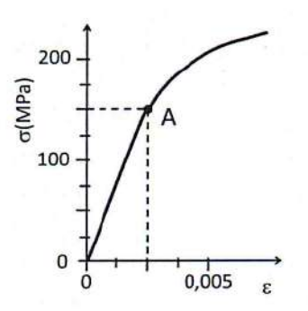

# **Unidad 1 - Ensayo en materiales - Problemas PAU - 24/25**

### Problema 1

Durante un ensayo de tracción de una probeta de 40 mm² de sección y 25#0 mm de longitud, al aplicarle una carga de 10000 N, se mide un alargamiento de 0,05 cm dentro del campo elástico. Calcule la tensión y el alargamiento unitario al aplicar la carga.

??? success "Problema 1 - solución"

    **Datos:**
    
    - Sección: $S = 40 \text{ mm}^2 = 40 \times 10^{-6} \text{ m}^2$
    - Longitud inicial: $L_0 = 250 \text{ mm} = 0,25 \text{ m}$
    - Carga: $F = 10000 \text{ N}$
    - Alargamiento: $\Delta L = 0,05 \text{ cm} = 0,5 \text{ mm} = 5 \times 10^{-4} \text{ m}$

    **a) Tensión ($\sigma$):**

    $$\sigma = \frac{F}{S} = \frac{10000}{40 \times 10^{-6}} = 250 \times 10^6 \text{ Pa} = \boxed{250 \text{ MPa}}$$

    **b) Alargamiento unitario ($\varepsilon$):**

    $$\varepsilon = \frac{\Delta L}{L_0} = \frac{0,5}{250} = \boxed{2 \times 10^{-3} = 0,002 \text{ (0,2 \%)}}$$

---

### Problema 2

En un ensayo de tracción efectuado a una probeta cilíndrica se ha obtenido el diagrama tensión-deformación que se representa en la figura, donde el punto A señala el límite elástico.

Determinar:

a) El módulo de elasticidad.  
b) El alargamiento de la probeta si se aplica una carga de 20000 N, sabiendo que su diámetro es 25 mm y su longitud 75 mm.  
c) La carga máxima que soporta esta probeta sin deformarse permanentemente.

??? success "Problema 2 - solución"

    **Datos del diagrama (deducidos de la figura típica PAU):**

    - Punto A (límite elástico): $\sigma_e = 250 \text{ MPa}$, $\varepsilon_e = 0,00125$
    - Carga aplicada: $F = 20000 \text{ N}$
    - Diámetro: $d = 25 \text{ mm} \Rightarrow S = \frac{\pi \cdot 25^2}{4} = 490,87 \text{ mm}^2$
    - Longitud: $L_0 = 75 \text{ mm}$

    **a) Módulo de elasticidad ($E$):**

    En la zona elástica (ley de Hooke): $E = \frac{\sigma}{\varepsilon}$

    $$E = \frac{250 \times 10^6}{0,00125} = \boxed{200 \text{ GPa}}$$

    **b) Alargamiento para F = 20000 N:**

    $$\sigma = \frac{F}{S} = \frac{20000}{490,87 \times 10^{-6}} = 40,74 \times 10^6 \text{ Pa} = 40,74 \text{ MPa}$$

    Como $\sigma < \sigma_e$ ($40,74 \text{ MPa} < 250 \text{ MPa}$), está en zona elástica.

    $$\varepsilon = \frac{\sigma}{E} = \frac{40,74 \times 10^6}{200 \times 10^9} = 2,037 \times 10^{-4}$$

    $$\Delta L = \varepsilon \cdot L_0 = 2,037 \times 10^{-4} \cdot 75 = \boxed{0,0153 \text{ mm}}$$

    **c) Carga máxima sin deformación permanente:**

    Es la carga correspondiente al límite elástico:

    $$F_{max} = \sigma_e \cdot S = 250 \times 10^6 \cdot 490,87 \times 10^{-6} = \boxed{122,7 \text{ kN}}$$

---

### Problema 3

En un laboratorio se pretende realizar un ensayo de dureza Brinell y otro de dureza Vickers para una misma muestra de acero:

a) Determinar la expresión normalizada de la dureza Brinell si en el ensayo se obtiene una huella de 2,5 mm de diámetro aplicando una carga de 725 kp con un penetrador de 5 mm de diámetro durante 20 segundos.  
b) Determinar la expresión normalizada de la dureza Vickers si en el ensayo se emplea una punta piramidal aplicando una carga de 120 kp durante 10 segundos y se obtiene como resultado una huella con diagonales de 1,25 mm y 1,23 mm.

??? success "Problema 3 - solución"

    **a) Dureza Brinell:**

    Fórmula: $HB = \frac{2F}{\pi \cdot D \cdot (D - \sqrt{D^2 - d^2})}$

    Datos: $F = 725 \text{ kp}$, $D = 5 \text{ mm}$, $d = 2,5 \text{ mm}$, $t = 20 \text{ s}$

    $$HB = \frac{2 \cdot 725}{\pi \cdot 5 \cdot (5 - \sqrt{5^2 - 2,5^2})} = \frac{1450}{\pi \cdot 5 \cdot (5 - \sqrt{18,75})}$$

    $$HB = \frac{1450}{\pi \cdot 5 \cdot (5 - 4,330)} = \frac{1450}{\pi \cdot 5 \cdot 0,670} = \frac{1450}{10,52} = 137,8$$

    Expresión normalizada: $\boxed{138 \text{ HB } 5/725/20}$

    **b) Dureza Vickers:**

    Fórmula: $HV = \frac{1,8544 \cdot F}{d^2}$ donde $d = \frac{d_1 + d_2}{2}$ (media de diagonales)

    Datos: $F = 120 \text{ kp}$, $d_1 = 1,25 \text{ mm}$, $d_2 = 1,23 \text{ mm}$, $t = 10 \text{ s}$

    $$d = \frac{1,25 + 1,23}{2} = 1,24 \text{ mm}$$

    $$HV = \frac{1,8544 \cdot 120}{1,24^2} = \frac{222,53}{1,5376} = 144,7$$

    Expresión normalizada: $\boxed{145 \text{ HV } 120/10}$

---

### Problema 4

Un ensayo de tipo Brinell que se realiza sobre un determinado metal da como resultado una dureza de 80 HB. La bola utilizada como penetrador es de 5 mm de diámetro y la huella que se obtiene al cabo de 30 s es de 2 mm de diámetro. Se pide:

a) La carga que se ha aplicado en el ensayo expresada en Newtons.  
b) La constante de ensayo del material.  
c) Expresar la dureza en su forma normalizada.

??? success "Problema 4 - solución"

    **Datos:** $HB = 80$, $D = 5 \text{ mm}$, $d = 2 \text{ mm}$, $t = 30 \text{ s}$

    **a) Carga aplicada ($F$):**

    Despejando de la fórmula de Brinell:

    $$HB = \frac{2F}{\pi \cdot D \cdot (D - \sqrt{D^2 - d^2})}$$

    $$80 = \frac{2F}{\pi \cdot 5 \cdot (5 - \sqrt{25 - 4})} = \frac{2F}{\pi \cdot 5 \cdot (5 - 4,583)} = \frac{2F}{\pi \cdot 5 \cdot 0,417}$$

    $$80 = \frac{2F}{6,55} \Rightarrow F = \frac{80 \cdot 6,55}{2} = 262 \text{ kp}$$

    $$F = 262 \text{ kp} \cdot 9,8 \text{ N/kp} = \boxed{2567,6 \text{ N} \approx 2568 \text{ N}}$$

    **b) Constante de ensayo ($k$):**

    $$k = \frac{F}{D^2} = \frac{262}{5^2} = \frac{262}{25} = \boxed{10,48 \text{ kp/mm}^2 \approx 10,5 \text{ kp/mm}^2}$$

    **c) Expresión normalizada:**

    $$\boxed{80 \text{ HB } 5/262/30 \text{ o } 80 \text{ HB } 5/250/30}$$

    *(Nota: En la normalización suele redondearse la carga a valores estándar)*

---

### Problema 5

Para medir la resiliencia de un material mediante un ensayo Charpy se ha utilizado una probeta de sección cuadrada de 10 mm de lado, con una entalla en forma de V de 2 mm de profundidad. La resiliencia obtenida fue de 220 J/cm² dejando caer un martillo de 35 kg desde una altura de 150 cm. Se pide:

a) Calcular la altura a la que se elevará el martillo tras golpear y romper la probeta.  
b) Si el martillo fuera de 20 kg de masa y se hubiera soltado desde una altura de 1,75 m, determinar la energía sobrante tras el impacto.

??? success "Problema 5 - solución"

    **Datos:**

    - Sección cuadrada: $a = 10 \text{ mm} \Rightarrow S_0 = 100 \text{ mm}^2$
    - Entalla: 2 mm de profundidad $\Rightarrow$ sección en la entalla: $S = 8 \text{ mm} \times 10 \text{ mm} = 80 \text{ mm}^2 = 0,8 \text{ cm}^2$
    - Resiliencia: $K = 220 \text{ J/cm}^2$
    - Masa martillo: $m = 35 \text{ kg}$
    - Altura inicial: $h_0 = 150 \text{ cm} = 1,5 \text{ m}$

    **Energía absorbida por la probeta:**

    $$E_{abs} = K \cdot S = 220 \cdot 0,8 = 176 \text{ J}$$

    **Energía inicial del martillo:**

    $$E_0 = m \cdot g \cdot h_0 = 35 \cdot 9,8 \cdot 1,5 = 514,5 \text{ J}$$

    **a) Altura final ($h_1$):**

    Energía sobrante: $E_{sobr} = E_0 - E_{abs} = 514,5 - 176 = 338,5 \text{ J}$

    $$E_{sobr} = m \cdot g \cdot h_1 \Rightarrow h_1 = \frac{338,5}{35 \cdot 9,8} = \frac{338,5}{343} = \boxed{0,987 \text{ m} \approx 98,7 \text{ cm}}$$

    **b) Con $m = 20$ kg y $h_0 = 1,75$ m:**

    $$E_0 = 20 \cdot 9,8 \cdot 1,75 = 343 \text{ J}$$

    Energía sobrante: $E_{sobr} = 343 - 176 = \boxed{167 \text{ J}}$

---

### Problema 6

En un ensayo Brinell se emplea una bola de 2,5 mm de diámetro y se aplica una carga que produce una huella de 1,2 mm de diámetro. La constante de ensayo para este material es 30 kp/mm². Se pide:

a) Determinar la carga aplicada en el ensayo y calcular la dureza Brinell del material.  
b) Si se usara una bola de 5 mm de diámetro, ¿cuál sería el diámetro de la huella?

??? success "Problema 6 - solución"

    **Datos:** $D = 2,5 \text{ mm}$, $d = 1,2 \text{ mm}$, $k = 30 \text{ kp/mm}^2$

    **a) Carga aplicada y dureza Brinell:**

    Relación de Brinell: $F = k \cdot D^2 = 30 \cdot 2,5^2 = 30 \cdot 6,25 = \boxed{187,5 \text{ kp}}$

    $$HB = \frac{2F}{\pi \cdot D \cdot (D - \sqrt{D^2 - d^2})} = \frac{2 \cdot 187,5}{\pi \cdot 2,5 \cdot (2,5 - \sqrt{6,25 - 1,44})}$$

    $$HB = \frac{375}{\pi \cdot 2,5 \cdot (2,5 - \sqrt{4,81})} = \frac{375}{\pi \cdot 2,5 \cdot (2,5 - 2,193)}$$

    $$HB = \frac{375}{\pi \cdot 2,5 \cdot 0,307} = \frac{375}{2,41} = \boxed{155,6 \approx 156 \text{ HB}}$$

    **b) Con $D = 5$ mm, manteniendo $k = 30$:**

    Carga: $F = k \cdot D^2 = 30 \cdot 25 = 750 \text{ kp}$

    Para mantener la misma dureza HB (mismo material), el diámetro de huella debe cumplir:

    $$\frac{d}{D} = \text{cte} \Rightarrow d_2 = 1,2 \cdot \frac{5}{2,5} = \boxed{2,4 \text{ mm}}$$

---

### Problema 7

A una varilla cilíndrica de latón de 10 mm de diámetro y 1 m de largo se le aplica una fuerza de tracción hasta su rotura. Su límite elástico es 250 MPa, el módulo de Young 120 GPa y el diámetro a la rotura 6,1 mm. Se pide:

a) Determinar si la varilla sufrirá una deformación permanente cuando se le aplique una fuerza de 2000 N.  
b) Calcular su alargamiento unitario para una fuerza de 1000 N.  
c) Calcular la estricción a la rotura.

??? success "Problema 7 - solución"

    **Datos:**
    
    - Diámetro: $d_0 = 10 \text{ mm} \Rightarrow S_0 = \frac{\pi \cdot 10^2}{4} = 78,54 \text{ mm}^2$
    - Longitud: $L_0 = 1 \text{ m} = 1000 \text{ mm}$
    - $\sigma_e = 250 \text{ MPa}$, $E = 120 \text{ GPa} = 120000 \text{ MPa}$
    - Diámetro rotura: $d_r = 6,1 \text{ mm}$

    **a) ¿Deformación permanente con $F = 2000$ N?**

    $$\sigma = \frac{F}{S_0} = \frac{2000}{78,54 \times 10^{-6}} = 25,46 \times 10^6 \text{ Pa} = 25,46 \text{ MPa}$$

    Como $\sigma = 25,46 \text{ MPa} < \sigma_e = 250 \text{ MPa}$

    $$\boxed{\text{NO sufre deformación permanente. Trabaja en zona elástica.}}$$

    **b) Alargamiento unitario para $F = 1000$ N:**

    $$\sigma = \frac{1000}{78,54 \times 10^{-6}} = 12,73 \text{ MPa}$$

    $$\varepsilon = \frac{\sigma}{E} = \frac{12,73}{120000} = \boxed{1,06 \times 10^{-4} = 0,000106 \text{ (0,0106 \%)}}$$

    **c) Estricción a la rotura:**

    $$Z = \frac{S_0 - S_r}{S_0} \cdot 100 = \frac{d_0^2 - d_r^2}{d_0^2} \cdot 100 = \frac{100 - 37,21}{100} \cdot 100$$

    $$Z = \frac{62,79}{100} \cdot 100 = \boxed{62,79 \%}$$

---

### Problema 8

En una empresa de fabricación de estructuras metálicas, se realiza un ensayo de tracción con la finalidad de verificar el cumplimiento con la normativa de vigas de acero. Para ello, se aplica una carga de 2000 N a una probeta de dicho material con un diámetro de 12 mm y una longitud inicial de 100 mm. Considerando un límite elástico de 225 MPa, se pide:

a) Determinar si la barra experimentará deformación permanente tras retirar la carga aplicada.  
b) Calcular el módulo de elasticidad considerando un alargamiento total de 0,008 mm.  
c) Determinar el diámetro mínimo para que dicha probeta no registre una deformación permanente al duplicar la carga aplicada.

??? success "Problema 8 - solución"

    **Datos:** $F = 2000 \text{ N}$, $d = 12 \text{ mm} \Rightarrow S = \frac{\pi \cdot 12^2}{4} = 113,1 \text{ mm}^2$, $L_0 = 100 \text{ mm}$, $\sigma_e = 225 \text{ MPa}$, $\Delta L = 0,008 \text{ mm}$

    **a) ¿Deformación permanente?**

    $$\sigma = \frac{2000}{113,1 \times 10^{-6}} = 17,68 \times 10^6 \text{ Pa} = 17,68 \text{ MPa}$$

    Como $17,68 \text{ MPa} < 225 \text{ MPa}$:

    $$\boxed{\text{NO. La barra recupera su longitud inicial (comportamiento elástico).}}$$

    **b) Módulo de elasticidad:**

    $$\varepsilon = \frac{\Delta L}{L_0} = \frac{0,008}{100} = 8 \times 10^{-5}$$

    $$E = \frac{\sigma}{\varepsilon} = \frac{17,68 \times 10^6}{8 \times 10^{-5}} = 221 \times 10^9 \text{ Pa} = \boxed{221 \text{ GPa}}$$

    **c) Diámetro mínimo para $F = 4000$ N sin deformación permanente:**

    $$\sigma \leq \sigma_e \Rightarrow \frac{F}{S} \leq \sigma_e \Rightarrow S \geq \frac{F}{\sigma_e}$$

    $$S_{min} = \frac{4000}{225 \times 10^6} = 1,778 \times 10^{-5} \text{ m}^2 = 17,78 \text{ mm}^2$$

    $$S = \frac{\pi \cdot d^2}{4} \Rightarrow d = \sqrt{\frac{4S}{\pi}} = \sqrt{\frac{4 \cdot 17,78}{\pi}} = \sqrt{22,63} = \boxed{4,76 \text{ mm}}$$

---

### Problema 9

En el aula taller de Tecnología e Ingeniería II, un grupo de estudiantes está desarrollando un proyecto de montaje de un ensayo Charpy. Se conoce que la resiliencia del material que se va a utilizar para el ensayo es de 30 J/cm² y que la probeta de sección cuadrada es de 10 mm de lado con una entalla de 2 mm. Además, quieren soltar el péndulo desde una altura de 2 m para que llegue, después de golpear la probeta, justo a la bandeja de los rotuladores de la pizarra que está a 1 m de altura. Responder a las siguientes cuestiones:

a) ¿Qué masa deberá de tener el martillo del péndulo que golpeará la probeta para conseguir el objetivo?  
b) Si cambiamos el martillo por uno de 10 kg, ¿a qué altura llegaría después de golpear la probeta?

??? success "Problema 9 - solución"

    **Datos:** $K = 30 \text{ J/cm}^2$, sección cuadrada $a = 10 \text{ mm}$, entalla 2 mm $\Rightarrow S = 8 \times 10 = 80 \text{ mm}^2 = 0,8 \text{ cm}^2$, $h_0 = 2 \text{ m}$, $h_1 = 1 \text{ m}$

    **Energía absorbida:**

    $$E_{abs} = K \cdot S = 30 \cdot 0,8 = 24 \text{ J}$$

    **a) Masa del martillo:**

    $$E_{abs} = E_0 - E_1 = m \cdot g \cdot (h_0 - h_1)$$

    $$24 = m \cdot 9,8 \cdot (2 - 1) = m \cdot 9,8$$

    $$m = \frac{24}{9,8} = \boxed{2,45 \text{ kg}}$$

    **b) Con $m = 10$ kg, altura final:**

    $$E_{abs} = m \cdot g \cdot (h_0 - h_1) \Rightarrow 24 = 10 \cdot 9,8 \cdot (2 - h_1)$$

    $$2 - h_1 = \frac{24}{98} = 0,245 \Rightarrow h_1 = 2 - 0,245 = \boxed{1,755 \text{ m}}$$

---

### Problema 10

En un laboratorio de control de calidad se realiza un ensayo Charpy a una probeta de acero estructural con una sección cuadrada de 10 mm de lado utilizando un péndulo de 20 kg de masa. El péndulo parte de una altura inicial de 1,2 m y, tras impactar con la probeta, alcanza una altura final de 30 cm. Se pide:

a) Calcular la energía absorbida por la probeta.  
b) Determinar la resiliencia del material.  
c) En caso de utilizar un péndulo de 18 kg de masa, ¿desde qué altura debería dejarse caer para alcanzar la misma altura final una vez rota la probeta?

??? success "Problema 10 - solución"

    **Datos:** $a = 10 \text{ mm}$, entalla estándar $\Rightarrow S = 0,8 \text{ cm}^2$ (asumiendo entalla de 2 mm), $m = 20 \text{ kg}$, $h_0 = 1,2 \text{ m}$, $h_1 = 0,3 \text{ m}$

    **a) Energía absorbida:**

    $$E_{abs} = m \cdot g \cdot (h_0 - h_1) = 20 \cdot 9,8 \cdot (1,2 - 0,3) = 20 \cdot 9,8 \cdot 0,9 = \boxed{176,4 \text{ J}}$$

    **b) Resiliencia:**

    $$K = \frac{E_{abs}}{S} = \frac{176,4}{0,8} = \boxed{220,5 \text{ J/cm}^2}$$

    **c) Con $m = 18$ kg, misma altura final (0,3 m):**

    Para misma energía absorbida (misma probeta, misma resiliencia):

    $$E_{abs} = m \cdot g \cdot (h_0' - h_1) \Rightarrow 176,4 = 18 \cdot 9,8 \cdot (h_0' - 0,3)$$

    $$h_0' - 0,3 = \frac{176,4}{176,4} = 1 \Rightarrow h_0' = \boxed{1,3 \text{ m}}$$

---

### Problema 11

Para fabricar una herramienta se compran dos planchas de acero con distintas durezas. La dureza normalizada de la primera plancha es 700 HV 25 y la de la segunda es 120 HB 5 250 30. Se pide:

a) Calcular la diagonal de la huella del ensayo Vickers en la primera plancha.  
b) Determinar la profundidad de la huella producida en el ensayo Brinell de la segunda plancha.

??? success "Problema 11 - solución"

    **Datos:** 

    - Plancha 1: $700 \text{ HV } 25$ → $F = 25 \text{ kp}$, $HV = 700$
    - Plancha 2: $120 \text{ HB } 5 \text{ } 250 \text{ } 30$ → $D = 5 \text{ mm}$, $F = 250 \text{ kp}$, $t = 30 \text{ s}$, $HB = 120$

    **a) Diagonal huella Vickers:**

    $$HV = \frac{1,8544 \cdot F}{d^2} \Rightarrow d = \sqrt{\frac{1,8544 \cdot F}{HV}}$$

    $$d = \sqrt{\frac{1,8544 \cdot 25}{700}} = \sqrt{\frac{46,36}{700}} = \sqrt{0,0662} = \boxed{0,257 \text{ mm} = 257 \text{ µm}}$$

    **b) Profundidad huella Brinell:**

    De la fórmula de Brinell, hallamos $d$ (diámetro huella):

    $$120 = \frac{2 \cdot 250}{\pi \cdot 5 \cdot (5 - \sqrt{25 - d^2})} = \frac{500}{\pi \cdot 5 \cdot (5 - \sqrt{25 - d^2})}$$

    $$\pi \cdot 5 \cdot (5 - \sqrt{25 - d^2}) = \frac{500}{120} = 4,167$$

    $$5 - \sqrt{25 - d^2} = \frac{4,167}{15,708} = 0,265$$

    $$\sqrt{25 - d^2} = 4,735 \Rightarrow 25 - d^2 = 22,42 \Rightarrow d^2 = 2,58 \Rightarrow d = 1,606 \text{ mm}$$

    Relación geométrica en la esfera (profundidad de penetración):

    $$h = \frac{D - \sqrt{D^2 - d^2}}{2} = \frac{5 - 4,735}{2} = \frac{0,265}{2} = \boxed{0,133 \text{ mm} = 133 \text{ µm}}$$

---

