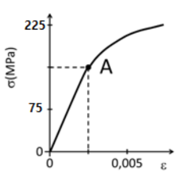
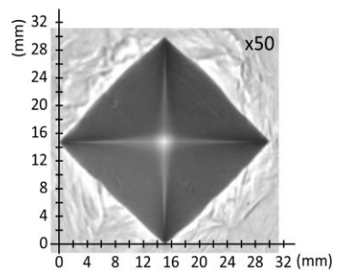

# **Unidad 1 - Ensayo en materiales - Problemas PAU - 25/26**

### Problema 1

En una carpintería metálica han comprado una plancha de acero de dureza Brinell **160 HB 5 650 20** para fabricar la superficie de trabajo de una mesa de carnicería. Posteriormente, el cliente les ha pedido que la mesa tenga el doble de dureza, por lo que deciden aplicarle un temple a la lámina para endurecerla. Para comprobar el efecto que este tratamiento térmico ha tenido en las propiedades de la plancha, realizan varios ensayos de dureza Brinell antes y después del temple.

Ayuda al operario que realiza los ensayos a analizar los resultados contestando las siguientes cuestiones:

a) ¿Cuál es la profundidad y el diámetro de la huella que deja el ensayo normalizado en la plancha original?  
b) Cuando el temple haya aumentado al doble la dureza de la plancha, ¿qué fuerza habrá que aplicar al acero templado para que el ensayo de dureza Brinell deje una huella igual que en el acero sin templar?

??? success "Problema 1 - solución"
   
    De la expresión normalizada **160 HB 5 650 20** extraemos los datos:

    - HB = 160 Kp/mm²
    - D = 5 mm (diámetro de la bola)
    - F = 650 kp (carga aplicada)
    - t = 20 s (tiempo de aplicación)

    **a) Diámetro y profundidad de la huella**

    Despejamos d de la fórmula de la dureza Brinell:

    $$HB = \frac{2F}{\pi \cdot D \cdot \left(D - \sqrt{D^2 - d^2}\right)}$$

    $$160 = \frac{2 \cdot 650}{\pi \cdot 5 \cdot \left(5 - \sqrt{25 - d^2}\right)}$$

    $$\pi \cdot 5 \cdot \left(5 - \sqrt{25 - d^2}\right) = \frac{1300}{160} = 8{,}125$$

    $$5 - \sqrt{25 - d^2} = \frac{8{,}125}{5\pi} = 0{,}517$$

    $$\sqrt{25 - d^2} = 4{,}483 \implies 25 - d^2 = 20{,}10 \implies d^2 = 4{,}90$$

    $$\boxed{d = 2{,}21 \text{ mm}}$$

    La profundidad de la huella:

    $$f = \frac{D - \sqrt{D^2 - d^2}}{2} = \frac{5 - 4{,}483}{2} = \frac{0{,}517}{2}$$

    $$\boxed{f = 0{,}258 \text{ mm}}$$

    **b) Fuerza para el acero templado**

    Tras el temple la dureza es el doble: HB' = 320.

    La huella debe ser igual (mismo d = 2,21 mm, mismo D = 5 mm), por lo que la fórmula queda:

    $$HB' = \frac{2F'}{\pi \cdot D \cdot \left(D - \sqrt{D^2 - d^2}\right)}$$

    Como el denominador es el mismo que antes:

    $$\frac{HB'}{HB} = \frac{F'}{F} \implies F' = F \cdot \frac{HB'}{HB} = 650 \cdot \frac{320}{160} = 1300 \text{ kp}$$

    Convirtiendo a Newtons:

    $$\boxed{F' = 1300 \text{ kp} \cdot 9{,}81 = 12.753 \text{ N}}$$

---

### Problema 2

En un ensayo de tracción efectuado a una probeta cilíndrica de un aluminio que se usará para la fabricación del cuadro de bicicletas, se ha obtenido el diagrama tensión-deformación representado en la figura, donde el punto A señala el límite elástico.

Determinar:

a) El módulo de elasticidad.  
b) El alargamiento de la probeta si se aplica una carga de 20.000 N, sabiendo que su diámetro es 25 mm y su longitud 75 mm.  
c) La carga máxima que soporta esta probeta sin deformarse permanentemente.

??? success "Problema 2 - solución"

    Del diagrama tensión-deformación leemos:

    - Punto A (límite elástico): σ_E = 225 MPa, ε = 0,005

    **a) Módulo de elasticidad**

    Aplicando la Ley de Hooke en la zona proporcional:

    $$E = \frac{\sigma}{\varepsilon} = \frac{225 \text{ MPa}}{0{,}005}$$

    $$\boxed{E = 45.000 \text{ MPa} = 45 \text{ GPa}}$$

    **b) Alargamiento para F = 20.000 N**

    Calculamos la sección de la probeta:

    $$A_0 = \frac{\pi \cdot d^2}{4} = \frac{\pi \cdot 25^2}{4} = 490{,}87 \text{ mm}^2$$

    Tensión aplicada:

    $$\sigma = \frac{F}{A_0} = \frac{20.000}{490{,}87} = 40{,}74 \text{ MPa}$$

    Deformación unitaria (Ley de Hooke):

    $$\varepsilon = \frac{\sigma}{E} = \frac{40{,}74}{45.000} = 9{,}05 \cdot 10^{-4}$$

    Alargamiento:

    $$\Delta l = \varepsilon \cdot l_0 = 9{,}05 \cdot 10^{-4} \cdot 75$$

    $$\boxed{\Delta l = 0{,}068 \text{ mm}}$$

    **c) Carga máxima sin deformación permanente**

    La carga máxima sin deformación permanente es la que corresponde al límite elástico σ_E = 225 MPa:

    $$F_{max} = \sigma_E \cdot A_0 = 225 \cdot 490{,}87$$

    $$\boxed{F_{max} = 110.446 \text{ N} \approx 110{,}4 \text{ kN}}$$

---

### Problema 3

En un laboratorio se realiza un ensayo de dureza Brinell y otro de dureza Vickers a una misma muestra de acero que se utilizará para la fabricación de rastrillos de jardinería. Se pide:

a) Determinar la expresión normalizada de la dureza Vickers si en el ensayo se emplea una punta piramidal aplicando una carga de 120 kp durante 10 segundos y se obtiene como resultado una huella con diagonales de 1,25 mm y 1,23 mm.  
b) Determinar la expresión normalizada de la dureza Brinell si en el ensayo se obtiene una huella de 2,5 mm de diámetro aplicando una carga de 725 kp con un penetrador de 5 mm de diámetro durante 20 segundos.  
c) A la vista de los datos y el resultado del ensayo de la dureza Brinell, ¿se puede considerar válido dicho resultado?

??? success "Problema 3 - solución"

    **a) Dureza Vickers**

    Calculamos la diagonal media:

    $$d = \frac{d_1 + d_2}{2} = \frac{1{,}25 + 1{,}23}{2} = 1{,}24 \text{ mm}$$

    Aplicamos la fórmula de la dureza Vickers:

    $$HV = \frac{1{,}854 \cdot F}{d^2} = \frac{1{,}854 \cdot 120}{1{,}24^2} = \frac{222{,}48}{1{,}5376}$$

    $$\boxed{HV = 144{,}7 \approx 145 Kp/mm²}$$

    Expresión normalizada: **145 HV 120 10**

    **b) Dureza Brinell**

    $$HB = \frac{2F}{\pi \cdot D \cdot \left(D - \sqrt{D^2 - d^2}\right)} = \frac{2 \cdot 725}{\pi \cdot 5 \cdot \left(5 - \sqrt{25 - 6{,}25}\right)}$$

    $$= \frac{1450}{\pi \cdot 5 \cdot (5 - \sqrt{18{,}75})} = \frac{1450}{\pi \cdot 5 \cdot (5 - 4{,}330)} = \frac{1450}{\pi \cdot 5 \cdot 0{,}670}$$

    $$= \frac{1450}{10{,}525}$$

    $$\boxed{HB = 137{,}8 \approx 138 Kp/mm²}$$

    Expresión normalizada: **138 HB 5 725 20**

    **c) Validez del ensayo Brinell**

    Para que el ensayo Brinell sea válido, el diámetro de la huella debe estar entre 0,24·D y 0,60·D (esta es una regla fundamental en ciencia de materiales para garantizar que los resultados de dureza sean precisos y fiables):

    $$0{,}24 \cdot D = 0{,}24 \cdot 5 = 1{,}2 \text{ mm}$$

    $$0{,}60 \cdot D = 0{,}60 \cdot 5 = 3{,}0 \text{ mm}$$

    Como d = 2,5 mm está comprendido entre 1,2 mm y 3,0 mm:

    $$\boxed{\text{El resultado es válido}}$$

---

### Problema 4

La empresa que está haciendo la obra de la estación de autobuses de Almería ha subcontratado a otra empresa que fabrica y monta estructuras metálicas para que haga la cubierta de la zona donde los autobuses se estacionan. Como en esa zona hay riesgo de que algún vehículo impacte con los pilares de la estructura, el proyecto técnico debe contener un estudio de la tenacidad a la fractura de estos pilares. Para hacer este estudio se realizan una serie de ensayos Charpy sacando varias probetas del acero de las vigas. Se usa un péndulo con una masa de 4 kg que se suelta desde 1 m de altura. Se pide:

a) Calcular la resiliencia del material de la viga si al hacer un ensayo con una probeta de sección cuadrada de 1,5 cm de lado con una entalla en V de 2 mm de profundidad el martillo sube hasta los 60 cm tras el impacto.  
b) Si al hacer otra probeta para repetir el ensayo se comete un error en la fabricación y la profundidad de la entalla es de 4 mm, en la misma sección cuadrada, ¿a qué altura subirá el péndulo para que la resiliencia sea la misma?  
c) Calcular y comparar la energía absorbida en la rotura de la probeta con 2 mm y con 4 mm de profundidad de entalla.

??? success "Problema 4 - solución"

    **Datos:**

    - m = 4 kg, g = 9,81 m/s²
    - h₁ = 1 m, h₂ = 0,60 m
    - Sección cuadrada: lado = 1,5 cm = 15 mm
    - Entalla en V: profundidad = 2 mm

    **a) Resiliencia con entalla de 2 mm**

    Energía absorbida:

    $$E_{abs} = m \cdot g \cdot (h_1 - h_2) = 4 \cdot 9{,}81 \cdot (1 - 0{,}60) = 4 \cdot 9{,}81 \cdot 0{,}40$$

    $$E_{abs} = 15{,}70 \text{ J}$$

    Sección efectiva (en la zona de la entalla):

    $$S = (15 - 2) \cdot 15 = 13 \cdot 15 = 195 \text{ mm}^2 = 1{,}95 \text{ cm}^2$$

    Resiliencia:

    $$K = \frac{E_{abs}}{S} = \frac{15{,}70}{1{,}95} = 8{,}05 \text{ J/cm}^2$$

    $$\boxed{K = 8{,}05 \text{ J/cm}^2}$$

    **b) Altura con entalla de 4 mm para la misma resiliencia**

    Nueva sección efectiva con entalla de 4 mm:

    $$S' = (15 - 4) \cdot 15 = 11 \cdot 15 = 165 \text{ mm}^2 = 1{,}65 \text{ cm}^2$$

    Energía absorbida necesaria para K = 8,05 J/cm²:

    $$E'_{abs} = K \cdot S' = 8{,}05 \cdot 1{,}65 = 13{,}28 \text{ J}$$

    Altura que alcanza el péndulo:

    $$h_2' = h_1 - \frac{E'_{abs}}{m \cdot g} = 1 - \frac{13{,}28}{4 \cdot 9{,}81} = 1 - 0{,}338$$

    $$\boxed{h_2' = 0{,}662 \text{ m} \approx 66{,}2 \text{ cm}}$$

    **c) Comparación de energías absorbidas**

    - Entalla 2 mm: $E_{abs} = 15{,}70$ J
    - Entalla 4 mm: $E'_{abs} = 13{,}28$ J

    La probeta con entalla de 4 mm absorbe **menos energía** (13,28 J < 15,70 J) porque su sección efectiva es menor. Al tener menos material que romper, el péndulo pierde menos energía en el impacto.

---

### Problema 5

En un almacén de envasado de fruta tienen una carretilla transportadora con capacidad para 6 cajas. El dueño del almacén ha detectado que la productividad mejoraría si tuvieran una carretilla para transportar 10 cajas, y encarga un proyecto para modificar la plataforma de la carretilla. El proyectista decide usar barras de acero de sección cuadrada de 2,5 cm de lado y 1 m de longitud, pero para el cálculo de la estructura necesita conocer las propiedades mecánicas del material y realiza un ensayo de tracción. Observa que con una fuerza mayor de 127 kN la barra deja de recuperar su longitud inicial tras el ensayo, pasando del régimen elástico al plástico, y para esta carga su longitud aumenta 0,96 mm. También ha visto que la barra se rompe cuando se le aplica una fuerza de 362 kN.

Ayuda al proyectista a calcular los siguientes parámetros mecánicos:

a) El módulo elástico del material.  
b) La deformación unitaria cuando se le aplica una fuerza de 48 kN.  
c) La tensión de rotura.

??? success "Problema 5 - solución"

    **Datos:**

    - Sección cuadrada: lado = 2,5 cm = 25 mm → A₀ = 25² = 625 mm²
    - Longitud: l₀ = 1 m = 1000 mm
    - Límite elástico: F_E = 127 kN, Δl = 0,96 mm
    - Fuerza de rotura: F_R = 362 kN

    **a) Módulo elástico**

    Tensión en el límite elástico:

    $$\sigma_E = \frac{F_E}{A_0} = \frac{127.000}{625} = 203{,}2 \text{ MPa}$$

    Deformación unitaria en el límite elástico:

    $$\varepsilon_E = \frac{\Delta l}{l_0} = \frac{0{,}96}{1000} = 9{,}6 \cdot 10^{-4}$$

    Módulo elástico:

    $$E = \frac{\sigma_E}{\varepsilon_E} = \frac{203{,}2}{9{,}6 \cdot 10^{-4}}$$

    $$\boxed{E = 211.667 \text{ MPa} \approx 212 \text{ GPa}}$$

    **b) Deformación unitaria para F = 48 kN**

    Como 48 kN < 127 kN, estamos en zona elástica, por lo que aplicamos la Ley de Hooke:

    $$\sigma = \frac{F}{A_0} = \frac{48.000}{625} = 76{,}8 \text{ MPa}$$

    $$\varepsilon = \frac{\sigma}{E} = \frac{76{,}8}{211.667}$$

    $$\boxed{\varepsilon = 3{,}63 \cdot 10^{-4}}$$

    **c) Tensión de rotura**

    $$\sigma_R = \frac{F_R}{A_0} = \frac{362.000}{625}$$

    $$\boxed{\sigma_R = 579{,}2 \text{ MPa}}$$

---

### Problema 6

Para medir la dureza de una plancha de acero se realiza un ensayo Vickers aplicando una carga de 40 kp durante 20 s, obteniéndose la huella de la figura.

a) Si la imagen está aumentada 50 veces, ¿cuánto mide la diagonal de la huella que se necesita para calcular la dureza Vickers?  
b) Calcular la dureza Vickers de la plancha y escribir su valor normalizado.

??? success "Problema 6 - solución"

    **Datos:**

    - F = 40 kp, t = 20 s
    - Ampliación de la imagen: ×50
    - Del diagrama se lee la diagonal ampliada: d_imagen = 30 mm (valor leído en la escala de la figura)

    **a) Diagonal real de la huella**

    $$d_{real} = \frac{d_{imagen}}{ampliaci\acute{o}n} = \frac{30}{50} = 0{,}6 \text{ mm}$$

    $$\boxed{d = 0{,}6 \text{ mm}}$$

    **b) Dureza Vickers**

    $$HV = \frac{1{,}854 \cdot F}{d^2} = \frac{1{,}854 \cdot 40}{0{,}6^2} = \frac{74{,}16}{0{,}36}$$

    $$\boxed{HV = 206 Kp/mm²}$$

    Expresión normalizada: **206 HV 40 20**

---

### Problema 7

Una fábrica de muebles metálicos ha comprado una plancha de acero inoxidable para hacer una mesa para la cocina del restaurante Burladero en Sevilla, y necesita conocer su dureza para optimizar el diseño. Para ello, realiza un ensayo Vickers aplicando una carga de 40 kp durante 20 s y obtiene la huella de la figura de la derecha vista con un microscopio que aumenta la imagen 50 veces.

a) ¿Cuánto mide la diagonal de la huella que se necesita para calcular la dureza Vickers?  
b) Calcular la dureza Vickers de la plancha y escribir su valor normalizado.

??? success "Problema 7 - solución"

    Este problema es análogo al Problema 6 con los mismos datos (F = 40 kp, t = 20 s, ampliación ×50). La solución es idéntica:

    **a) Diagonal de la huella**

    $$d_{real} = \frac{d_{imagen}}{50} = \frac{30}{50} = 0{,}6 \text{ mm}$$

    $$\boxed{d = 0{,}6 \text{ mm}}$$

    **b) Dureza Vickers**

    $$HV = \frac{1{,}854 \cdot 40}{0{,}6^2} = \frac{74{,}16}{0{,}36}$$

    $$\boxed{HV = 206 Kp/mm²$$}

    Expresión normalizada: **206 HV 40 20**

