# **Unidad 1 - Ensayo en materiales**

## 1. Introducción

Los materiales son necesarios para la fabricación de productos. Estos están elaborados con el material que mejor se adapte a su uso y que resulte más económico. La elección del material adecuado para una aplicación concreta es vital si no se quiere fracasar.

Ingenieros y técnicos deben conocer los tipos de materiales susceptibles de ser empleados y sus diferentes grados de calidad, y así sopesar las ventajas y los inconvenientes a la hora de elegir el mejor, que no tiene por qué coincidir con el más caro.

## 2. Propiedades de los materiales

Para utilizar cualquier material de forma correcta y sacar de él su máxima utilidad, y que se ajuste a una finalidad concreta, es necesario conocer sus propiedades y cualidades.

En el proceso de diseño de productos industriales, al llegar a la etapa de elección de materiales, el encargado de hacerlo deberá seleccionarlos no sólo según criterios tecnológicos y económicos, sino que, además, deberá tener en cuenta criterios estéticos, es decir, deberá valorar las capacidades expresivas del material y del resultado perceptivo que este inducirá en las personas, que se relacionará de algún modo sensorial con el objeto construido.

### 2.1 Propiedades mecánicas de los materiales

Las propiedades mecánicas de los materiales definen el comportamiento de los metales en su utilización industrial. Las más importantes son las siguientes:

- **Elasticidad**: es la capacidad que tienen los materiales de recuperar la forma primitiva cuando cesa la carga que los deforma. Si se rebasa el límite elástico, la deformación que se produce es permanente.
- **Plasticidad**: es la capacidad que tienen los materiales de adquirir deformaciones permanentes sin llegar a la rotura. Cuando esta deformación se presenta en forma de láminas, se denomina maleabilidad y, si se presenta en forma de filamentos, ductilidad.
- **Cohesión**: es la resistencia que ofrecen los átomos a separarse y depende del enlace de estos. Los átomos de los metales se pueden separar ligeramente, de ahí su elasticidad.
- **Dureza**: es la mayor o menor resistencia que oponen los cuerpos a ser rayados o penetrados y depende de la cohesión atómica.
- **Tenacidad**: es la capacidad de resistencia a la rotura por la acción de fuerzas exteriores.
- **Fragilidad**: es la propiedad opuesta a la tenacidad; el intervalo plástico es muy corto y, por tanto, sus límites elástico y de rotura están muy próximos.
- **Resistencia a la fatiga**: es la resistencia que ofrece un material a los esfuerzos repetitivos.
- **Resiliencia**: es la energía absorbida en una rotura por impacto.

## 3. Ensayo de tracción

Este ensayo mecánico consiste en someter a una probeta de forma y dimensiones normalizadas a un sistema de fuerzas exteriores (esfuerzo de tracción) en la dirección de su eje longitudinal hasta romperla.

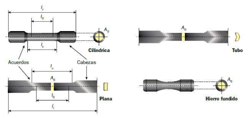

### 3.1 Deformaciones elásticas y plásticas

Cuando sometemos un material a una tensión, se deforma. Si al cesar la fuerza el material recupera sus dimensiones primitivas, se dice que ha experimentado una **deformación elástica**.

Si el material se deforma hasta el extremo de no poder recuperar por completo sus medidas originales, se dice que ha experimentado una **deformación plástica**.

### 3.2 Tensión y deformación

Consideremos una varilla cilíndrica de longitud L₀ y una sección A₀, sometida a una tensión F de tracción.

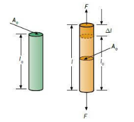

Definiremos **tensión σ** como el cociente entre la fuerza de tracción F y la sección transversal A₀ de la varilla:

$$\sigma = \frac{F}{A_0}$$

La unidad de tensión en el Sistema Internacional es el pascal: 1 Pa = 1 N/m².

Cuando se aplica a una varilla una fuerza de tracción, se provoca un alargamiento o elongación de esta en la dirección de la fuerza. Este desplazamiento se llama **deformación**.

### 3.3 Análisis de un diagrama de tracción

Los resultados obtenidos en la realización de un ensayo de tracción se representan en una gráfica de tal manera que obtenemos una curva que relaciona las tensiones con las deformaciones relativas a la longitud inicial, llamadas alargamientos unitarios.

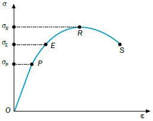

Al estudiar este diagrama, podemos distinguir dos zonas fundamentales:

- **Zona elástica (OE).** Se caracteriza por que al cesar las tensiones aplicadas, los materiales recuperan su longitud original l₀.
  - **Zona de proporcionalidad (OP).** Se trata de una recta, por lo que existe una proporcionalidad entre las tensiones aplicadas y los alargamientos unitarios. Es la zona donde deben trabajar los materiales.
  - **Zona no proporcional (PE).** El material se comporta de forma elástica, pero las deformaciones y tensiones no están relacionadas linealmente. No es una zona aconsejable para trabajar los materiales.

- **Zona plástica (ES).** Se ha rebasado la tensión del límite elástico σE de forma que, aunque dejemos de aplicar tensiones de tracción, el material ya no recupera su longitud original.
  - **Zona límite de rotura (ER).** Zona donde a pequeñas variaciones de tensión se producen grandes alargamientos. El límite de esta zona es el punto R, llamado **límite de rotura**.
  - **Zona de rotura (RS).** Superado el punto R, el material sigue alargándose progresivamente hasta que se produce la rotura física total en el punto S.

> **Caso especial: el acero.** Su diagrama de tracción presenta una zona localizada por encima del límite elástico donde se produce un alargamiento muy rápido sin que varíe la tensión aplicada. Este fenómeno se conoce como **fluencia**. El punto donde comienza se llama **límite de fluencia (F)**.
>
> 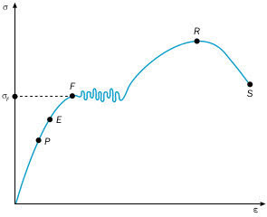

### 3.4 Ley de Hooke

En la zona de proporcionalidad (OP), las tensiones aplicadas sobre un elemento resistente son directamente proporcionales a las deformaciones producidas, dentro del comportamiento elástico de los materiales.

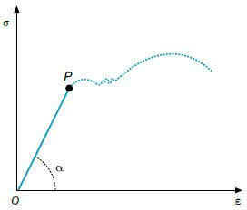

$$\sigma = E \cdot \varepsilon$$

El valor **E** se conoce como **módulo elástico o módulo de Young**, que representa la pendiente de la curva tensión-deformación en la región elástica. Es un parámetro característico de cada material y se mide en kp/cm², kp/mm² o N/m².

**Ley de Hooke: Los alargamientos unitarios (deformaciones) son proporcionales a las tensiones que los producen, cuya constante de proporcionalidad es el módulo elástico.**

## 4. Ensayos de dureza

La dureza es la resistencia que ofrece un material a ser rayado o penetrado por otro. La propiedad mecánica que se determina a través de los ensayos de dureza es la cohesión.

Entre las técnicas cuantitativas para determinar la dureza de los materiales, se encuentran los **ensayos de penetración**. Se basan en un pequeño penetrador que es forzado sobre la superficie del material a ensayar en condiciones controladas de carga y velocidad de aplicación. En estos ensayos se mide la profundidad o tamaño de la huella resultante.

La dureza, por definición, es una propiedad de la capa superficial del material, y no una propiedad del material en sí.

### 4.1 Ensayo Brinell

Consiste en comprimir una **bola de acero templado**, de un diámetro determinado, contra el material a ensayar, por medio de una carga (F) y durante un tiempo determinado.

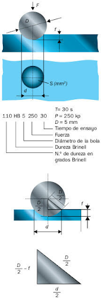

Se mide el diámetro de la huella y se calcula la dureza del material en función de la carga aplicada y del área del casquete de la huella:

$$HB = \frac{F}{S}$$

donde:
- **HB** = dureza en grados Brinell
- **F** = carga aplicada (kp)
- **S** = área del casquete (mm²)

La superficie del casquete de la huella es:

$$S = \pi \cdot D \cdot f$$

donde:
- **D** = diámetro de la bola (mm)
- **f** = profundidad de la huella (mm)

La profundidad de la huella se obtiene a partir de la relación entre D y el diámetro de la huella d:

$$f = \frac{D - \sqrt{D^2 - d^2}}{2}$$

Sustituyendo, la fórmula completa de la dureza Brinell queda:

$$HB = \frac{2F}{\pi \cdot D \cdot \left(D - \sqrt{D^2 - d^2}\right)}$$

Generalmente no se calcula aplicando la fórmula, sino por medio de **tablas** donde, conocido el diámetro de la huella, se encuentra directamente el valor de la dureza.

Este ensayo da resultados fiables en materiales de perfil grueso. No es adecuado para espesores inferiores a 6 mm.

Las cargas deben ser proporcionales al cuadrado del diámetro para que las huellas sean comparables:

$$\frac{F}{D^2} = K$$

La constante K depende de la clase de material (mayor para materiales duros, menor para blandos).

### 4.2 Ensayo Vickers

El penetrador utilizado es una **pirámide regular de base cuadrada** cuyas caras laterales forman un ángulo de 136°.

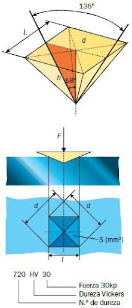

Se recomienda para durezas superiores a 500 HB. Presenta ventajas respecto al Brinell: se puede usar tanto para materiales duros como blandos, y los espesores pueden ser muy pequeños (hasta 0,05 mm).

Las cargas que se utilizan son de 1 a 120 kp, aunque lo normal es emplear 30 kp.

$$HV = \frac{1,854 \cdot F}{d^2}$$

donde:
- **HV** = dureza en grados Vickers
- **F** = carga aplicada (kp)
- **d** = diagonal de la huella (mm)

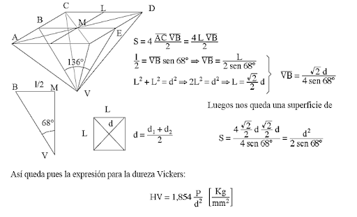

### 4.3 Ensayo Rockwell

A diferencia de Brinell y Vickers, en este ensayo se mide la **profundidad de la huella "e"**, no su área.

- Para materiales **blandos** (60–150 HV): penetrador esférico de acero → escala **HRB**
- Para materiales **duros** (235–1075 HV): cono de diamante 120° → escala **HRC**

Los pasos del ensayo son:

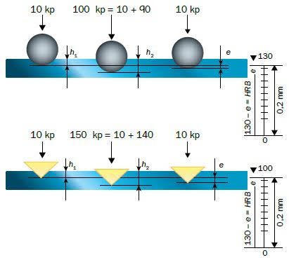

1. Precarga de 10 kp → se obtiene h₁
2. Se aplica el resto de la carga (90 kp para HRB / 140 kp para HRC) → se obtiene h₂
3. Se reduce la carga hasta la precarga → se obtiene h₃
4. Se calcula e:

$$e = \frac{h_3 - h_1}{0{,}002}$$

La dureza se obtiene:

$$HRC = 100 - e$$

$$HRB = 130 - e$$

## 5. Ensayo Charpy

Entre los ensayos de flexión por choque, el más utilizado es el **ensayo de resiliencia** o ensayo Charpy, en el que se dispone de una probeta de sección cuadrada con una entalla en su parte central.

El ensayo consiste en golpear la probeta por el lado opuesto a la entalla con un **péndulo** que se deja caer desde una cierta altura.

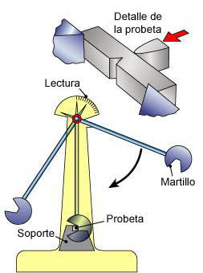

Mediante este ensayo calculamos la **resiliencia** de un material, que podemos definir como la resistencia que opone un material a romperse al ser golpeado bruscamente.

La resiliencia se calcula como la energía absorbida por la probeta durante la rotura dividida entre la sección de la probeta en la zona de entalla:

$$K = \frac{E_{absorbida}}{S_{entalla}}$$

La energía absorbida se obtiene a partir de la diferencia de alturas del péndulo antes y después del impacto:

$$E_{absorbida} = m \cdot g \cdot (h_1 - h_2)$$

donde:
- **m** = masa del péndulo (kg)
- **g** = aceleración de la gravedad (9,8 m/s²)
- **h₁** = altura inicial del péndulo (m)
- **h₂** = altura final del péndulo tras el impacto (m)

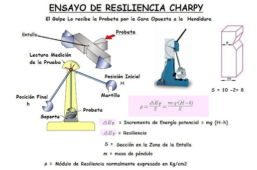

## 📋 Formulario

### Ensayo de tracción

**Tensión (Esfuerzo normal)**

$$\sigma = \frac{F}{S}$$

Donde:

- $\sigma$ = Tensión (Pa, MPa, GPa)
- $F$ = Fuerza o carga aplicada (N)
- $S$ = Sección transversal (m², mm²)

**Deformación unitaria (Alargamiento relativo)**

$$\varepsilon = \frac{\Delta L}{L_0} = \frac{L - L_0}{L_0}$$

Donde:

- $\varepsilon$ = Deformación unitaria (adimensional, %)
- $\Delta L$ = Alargamiento (m, mm)
- $L_0$ = Longitud inicial (m, mm)
- $L$ = Longitud final (m, mm)

**Ley de Hooke (Zona elástica)**

$$\sigma = E \cdot \varepsilon$$

Donde:

- $E$ = Módulo de elasticidad o Módulo de Young (Pa, GPa)

**Cálculo del módulo de elasticidad**

$$E = \frac{\sigma}{\varepsilon}$$

**Cálculo del alargamiento**

$$\Delta L = \varepsilon \cdot L_0 = \frac{\sigma}{E} \cdot L_0 = \frac{F \cdot L_0}{S \cdot E}$$

**Límite elástico - Condición de no deformación permanente**

$$\sigma \leq \sigma_e \Rightarrow \frac{F}{S} \leq \sigma_e$$

Si $\sigma < \sigma_e$ → comportamiento elástico (recupera forma)

Si $\sigma > \sigma_e$ → deformación plástica permanente

**Resumen de condiciones**

| Situación | Condición | Resultado |
|-----------|-----------|-----------|
| Comportamiento elástico | $\sigma < \sigma_e$ | Recupera forma original |
| Límite elástico | $\sigma = \sigma_e$ | Límite de proporcionalidad |
| Deformación plástica | $\sigma > \sigma_e$ | Deformación permanente |
| Rotura | $\sigma = \sigma_{rotura}$ | Fractura del material |

**Carga máxima en zona elástica**

$$F_{max} = \sigma_e \cdot S$$

**Diámetro mínimo para no deformarse permanentemente**

$$S_{min} = \frac{F}{\sigma_e} \Rightarrow d_{min} = \sqrt{\frac{4 \cdot F}{\pi \cdot \sigma_e}}$$

**Deformación unitaria en el límite elástico**

$$\varepsilon_e = \frac{\sigma_e}{E}$$

**Estricción (Reducción de área en la rotura)**

$$Z = \frac{S_0 - S_r}{S_0} \cdot 100 = \frac{d_0^2 - d_r^2}{d_0^2} \cdot 100 \quad (\%)$$

Donde:

- $S_0$ = Sección inicial
- $S_r$ = Sección en la rotura
- $d_0$ = Diámetro inicial
- $d_r$ = Diámetro en la rotura

### Ensayo de dureza Brinell

**Fórmula de la dureza Brinell**

$$HB = \frac{2F}{\pi \cdot D \cdot (D - \sqrt{D^2 - d^2})}$$

Donde:

- $HB$ = Dureza Brinell (kp/mm²)
- $F$ = Carga aplicada (kp)
- $D$ = Diámetro del penetrador esférico (mm)
- $d$ = Diámetro de la huella (mm)

**Expresión normalizada**

$$\text{XXX HB } D/F/t$$

Ejemplo: $179 \text{ HB } 10/3000/15$

**Constante de ensayo**

$$k = \frac{F}{D^2} \quad (\text{kp/mm}^2)$$

**Carga aplicada (conociendo k)**

$$F = k \cdot D^2$$

**Profundidad de la huella**

$$h = \frac{D - \sqrt{D^2 - d^2}}{2}$$

**Relación de semejanza (mismo material, misma HB)**

$$\frac{d_1}{D_1} = \frac{d_2}{D_2} \Rightarrow d_2 = d_1 \cdot \frac{D_2}{D_1}$$

**Mismo material, diferente penetrador**

$$\frac{F_1}{D_1^2} = \frac{F_2}{D_2^2} = k$$

### Ensayo de dureza Vickers

**Fórmula de la dureza Vickers**

$$HV = \frac{1,8544 \cdot F}{d^2}$$

Donde:

- $HV$ = Dureza Vickers
- $F$ = Carga aplicada (kp)
- $d$ = Diagonal media de la huella (mm) = $\frac{d_1 + d_2}{2}$

**Expresión normalizada**

$$\text{XXX HV } F/t$$

Ejemplo: $890 \text{ HV } 30/20$

**Cálculo de la diagonal (conociendo HV)**

$$d = \sqrt{\frac{1,8544 \cdot F}{HV}}$$

**Carga para una diagonal dada (mismo material)**

$$F = \frac{HV \cdot d^2}{1,8544}$$

**Relación entre cargas y diagonales (mismo material)**

$$\frac{F_1}{d_1^2} = \frac{F_2}{d_2^2} \Rightarrow d_2 = d_1 \cdot \sqrt{\frac{F_2}{F_1}}$$

**Superficie de la huella**

$$A = \frac{d^2}{2 \cdot \sin(68°)} = \frac{d^2}{1,8544}$$

### Ensayo de resiliencia (Charpy)

**Energía potencial inicial**

$$E_0 = m \cdot g \cdot h_0$$

Donde:

- $E_0$ = Energía inicial (J)
- $m$ = Masa del martillo (kg)
- $g$ = Gravedad = $9,8 \text{ m/s}^2$
- $h_0$ = Altura inicial (m)

**Energía potencial final (tras el impacto)**

$$E_1 = m \cdot g \cdot h_1$$

Donde:

- $h_1$ = Altura final (m)

**Energía absorbida por la probeta**

$$E_{abs} = E_0 - E_1 = m \cdot g \cdot (h_0 - h_1)$$

**Resiliencia del material**

$$K = \frac{E_{abs}}{S}$$

Donde:

- $K$ = Resiliencia (J/cm², J/m²)
- $S$ = Sección en la zona de entalla (cm², m²)

**Sección en la zona de entalla (probeta cuadrada con entalla)**

$$S = (a - x) \cdot a$$

Donde:

- $a$ = Lado de la sección cuadrada (mm)
- $x$ = Profundidad de la entalla (mm)

**Cálculo de la masa del martillo**

$$m = \frac{E_{abs}}{g \cdot (h_0 - h_1)}$$

**Cálculo de la altura inicial**

$$h_0 = h_1 + \frac{E_{abs}}{m \cdot g}$$

**Cálculo de la altura final**

$$h_1 = h_0 - \frac{E_{abs}}{m \cdot g}$$

**Velocidad de impacto (punto más bajo)**

$$v = \sqrt{2 \cdot g \cdot h_0}$$

