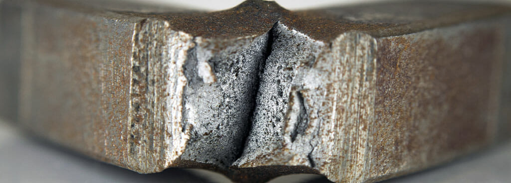

# UD1 Ensayos en materiales

!!! quote "Cyril Stanley Smith"
    "Los materiales son el punto de partida de toda la tecnología. 
    Sin conocer sus propiedades, no es posible diseñar nada que funcione."

El estudio de los materiales y sus propiedades mecánicas es fundamental 
en ingeniería. Los ensayos de tracción, dureza y resiliencia permiten 
conocer cómo se comportan los materiales ante diferentes esfuerzos, 
garantizando la seguridad y fiabilidad de las estructuras y máquinas.

---

[Descargar UD1 Ensayos en materiales](https://drive.google.com/file/d/19UbsKuTqBxoyUnfxU6cSCCGc5L1Zo89f/view?usp=drive_link){ .md-button .md-button--primary }