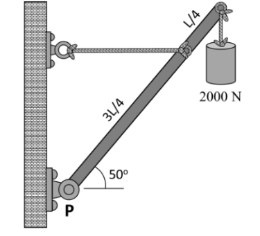
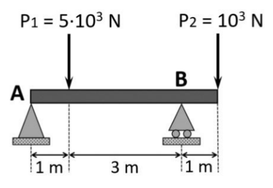
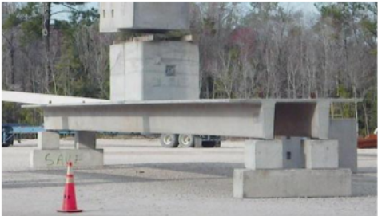
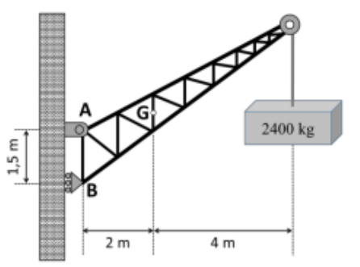
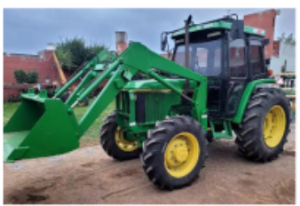

# **Unidad 2 - Estructuras - Problemas PAU - 25/26**

### Problema 1

Se requiere analizar la viga representada en la figura de la derecha. Considerando los datos proporcionados, calcular:

a) Las reacciones en ambos apoyos en condiciones de equilibrio estático.

b) El momento flector máximo en la viga.

### Problema 2

En la figura dse representa la estructura que se ha montado para colgar un cartel que pesa 513 N en la fachada de un edificio. La barra horizontal de la que cuelga el cartel mide 2,80 m de largo, su masa es despreciable y se sujeta a la pared con un apoyo fijo (A). El otro extremo de la barra (B) se sujeta con un cable tensor que se fija a la pared 3,2 m por encima del apoyo. El cartel se sujeta a la barra en un único punto (C) situado a 95 cm del extremo derecho de la barra. Se pide:

a)​ Dibujar el diagrama del sólido libre.

b)​ Calcular la tensión resultante que está soportando el cable tensor.

### Problema 3

En el sistema en equilibrio que se muestra en la figura adjunta, la viga uniforme de longitud L pesa 0,60 kN y está sujeta a un apoyo articulado fijo en el punto A y a una cuerda tensora en el punto B. En el otro extremo, la viga sujeta un peso de 0,80 kN.

Se pide:

a)​ Dibujar el diagrama del sólido libre indicando correctamente el sentido de todas las fuerzas.

b)​ Calcular la tensión en la cuerda tensora y las componentes de la fuerza de reacción que ejerce el apoyo articulado fijo sobre la viga.

### Problema 4

Se requiere analizar la viga presentada en la figura adjunta:

Considerando los datos proporcionados, calcular:

a)​ Las reacciones en ambos apoyos en condiciones de equilibrio estático.

b)​ Las ecuaciones de fuerzas cortantes y momentos flectores en cada tramo de la viga en función de la coordenada “x”.

c)​ Representar los diagramas de esfuerzos cortantes y momentos flectores en la viga.

### Problema 5

Un asta de peso 0,40 N y densidad uniforme está suspendida como se muestra en la figura. En su extremo libre sujeta un peso de 2 kN.

Se pide:

a)​ Dibujar el diagrama del sólido libre indicando correctamente el sentido de todas las fuerzas.

b)​ Calcular la tensión en la cuerda y la fuerza que ejerce el pivote en P sobre el asta.

### Problema 6

Un asta de peso 0,40 N y densidad uniforme está suspendida como se muestra en la figura. En su extremo libre sujeta un peso de 2 kN.

Considerando los datos proporcionados, analizar la estructura calculando:

a)​ Las reacciones en ambos apoyos en condiciones de equilibrio estático.

b)​ Representar los diagramas de esfuerzos cortantes y momentos flectores en la viga.

c)​ Obtener el momento flector máximo.

### Problema 7

Se requiere analizar una viga de 5 m con su extremo derecho (punto B) empotrado en una pared. Sobre el extremo izquierdo (punto A) actúa una fuerza peso de 3 kN, y a 2 m del empotramiento se localiza otra fuerza peso de 2 kN. Se pide:

a)​ Calcular el valor de las reacciones que se producen en el empotramiento (punto B) en condiciones de equilibrio estático.

b)​ Representar los diagramas de esfuerzos cortantes y momentos flectores en la viga en función de x.

### Problema 8

Para colgar un cartel en la fachada de un edificio, se usa una barra horizontal con un extremo fijo en la pared a cierta altura. El otro extremo de la barra se sujeta con un cable tensor que se fija a la pared 3,2 m por encima del apoyo fijo de la barra. La barra mide 2,8 m de largo y su masa es despreciable. El cartel es cuadrado, de 1,9 m de lado y 52,3 kg. Cuelga del punto central de su lado superior mediante un cable fijado a la barra, de modo que el extremo derecho del cartel queda alineado con el extremo derecho de la barra. Se pide:

a) Dibujar el diagrama del sólido libre indicando correctamente el sentido de todas las fuerzas.

b) Calcular la tensión del cable de soporte.

c) Calcular las componentes horizontal y vertical de la reacción ejercida por la pared.

### Problema 9

Para evitar inundaciones con las crecidas, se ha canalizado el río Guadalquivir a su paso por Sevilla en varios tramos, y la expansión de la ciudad hace necesario construir un nuevo puente sobre el canal de 46 m de ancho. Se estudia la opción de construir el puente con vigas de hormigón armado tipo Doble T como las de la figura, que pueden alcanzar hasta los 53 m de largo. Tras el estudio del terreno, se decide usar una viga de 50 m de largo apoyada en un extremo en un soporte fijo y el otro en un apoyo móvil o de rodillo. El puente debe soportar el paso de vehículos pesados, por lo que se diseñará para una masa máxima de vehículos de 65 toneladas. La masa de la viga es de 110,5 toneladas. Colabora en el diseño del puente resolviendo las siguientes cuestiones.

a) Dibujar el diagrama de sólido libre del puente cuando el vehículo ha recorrido 25 m, y calcular las reacciones.

b) Representar los diagramas de esfuerzos cortantes y momentos flectores.

### Problema 10

Una grúa fija tiene una masa de 1 000 kg y se usa para levantar un contenedor de 2 400 kg. La grúa se mantiene en su lugar por medio de un perno en A y un balancín en B. El perno es un tipo de anclaje fijo que permite rotaciones de la grúa, pero no traslaciones, y un balancín es un apoyo móvil tipo rodillo que permite rotaciones y traslaciones. El centro de gravedad de la grúa está ubicado en G de acuerdo con el siguiente dibujo.

Se pide:

a) Dibujar el diagrama del sólido libre.

b) Calcular la fuerza de reacción en los apoyos A y B.

### Problema 11

El estudio de arquitectura Andalusí está desarrollando el proyecto de un bloque de viviendas en primera línea de playa en Almería. Una de las viviendas del ático dispone de una terraza voladiza de 4 m de longitud que sobresale desde la fachada principal. La terraza se modela como una viga con un extremo empotrado en la fachada y el otro extremo en voladizo. Teniendo en cuenta el tamaño total de la terraza, se estima que durante una fiesta puede albergar un grupo de personas con un peso total de 8,5 kN. El peso de la losa de hormigón de la terraza es de 16,8 kN.

a)​ Dibujar el diagrama de cuerpo libre de la terraza y calcular las reacciones considerando la fuerza peso del grupo de personas como una carga puntual aplicada en el centro.

b)​ Representar los diagramas de esfuerzos cortantes y momentos flectores resultantes. Determinar el valor del momento flector máximo que soportará la terraza y en qué posición se encuentra.

### Problema 12

Un tractor como el de la figura tiene una masa de 2100 lb y se utiliza para levantar 900 lb de grava en su pala delantera. El tractor se apoya en las ruedas traseras y delanteras, que están separadas 60 in. El centro de gravedad del tractor se sitúa 20 in por delante de las ruedas traseras, y durante el transporte el centro de gravedad de la pala cargada se encuentra 50 in por delante de las ruedas delanteras.

Se pide:

a) Dibujar el diagrama del sólido libre indicando correctamente el sentido de todas las fuerzas.

b) Calcular las reacciones en ruedas traseras (apoyo A) y en las delanteras (apoyo B).

(Datos: 1 lb = 0,454 kg; 1 in = 2,54 cm).
