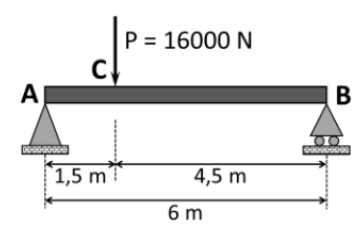
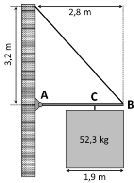
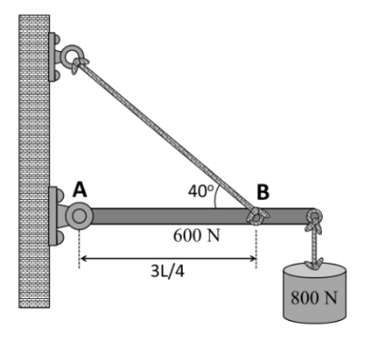

# **Unidad 2 - Estructuras - Problemas PAU - 25/26**

### Problema 1

Se requiere analizar la viga representada en la figura. Considerando los datos proporcionados, calcular:

a) Las reacciones en ambos apoyos en condiciones de equilibrio estático.

b) El momento flector máximo en la viga.

### Problema 2

En la figura dse representa la estructura que se ha montado para colgar un cartel que pesa 513 N en la fachada de un edificio. La barra horizontal de la que cuelga el cartel mide 2,80 m de largo, su masa es despreciable y se sujeta a la pared con un apoyo fijo (A). El otro extremo de la barra (B) se sujeta con un cable tensor que se fija a la pared 3,2 m por encima del apoyo. El cartel se sujeta a la barra en un único punto (C) situado a 95 cm del extremo derecho de la barra. Se pide:

a)​ Dibujar el diagrama del sólido libre.

b)​ Calcular la tensión resultante que está soportando el cable tensor.

### Problema 3

En el sistema en equilibrio que se muestra en la figura adjunta, la viga uniforme de longitud L pesa 0,60 kN y está sujeta a un apoyo articulado fijo en el punto A y a una cuerda tensora en el punto B. En el otro extremo, la viga sujeta un peso de 0,80 kN.

Se pide:

a)​ Dibujar el diagrama del sólido libre indicando correctamente el sentido de todas las fuerzas.

b)​ Calcular la tensión en la cuerda tensora y las componentes de la fuerza de reacción que ejerce el apoyo articulado fijo sobre la viga.