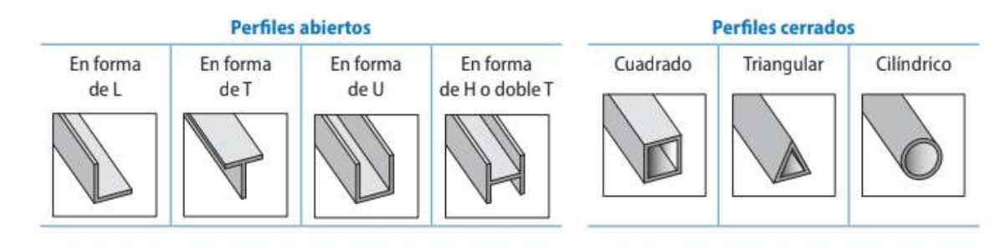

# **Unidad 2 - Estructuras**

## 1. Estructuras. Elementos de estructuras sencillas

Una **estructura artificial** es el conjunto de partes de una construcción compuestas por elementos resistentes unidos entre sí por sus extremos, con la finalidad de soportar, sin romperse, las cargas y los efectos de los agentes exteriores a que se encuentran sometidos.

### 1.1 Tipos de elementos estructurales

Los elementos estructurales se clasifican según su posición y el esfuerzo que soportan:

- **Lineales**: vigas, pilares, arcos, tirantes.
- **Superficiales**: muros, forjados.

Los elementos están formados por **perfiles**, que son las formas comerciales en que se suministran los aceros y otros materiales.

<!-- 📷 IMAGEN 1: Tabla de perfiles estructurales (abiertos: L, T, U, H; cerrados: cuadrado, triangular, cilíndrico) -->
> **[IMAGEN: Perfiles estructurales abiertos y cerrados]**

### 1.2 Esfuerzos internos

Los **esfuerzos** son las tensiones internas a las que se somete un cuerpo cuando actúan sobre él varias fuerzas externas. Los tipos principales son:

| Esfuerzo | Descripción | Elemento típico |
|----------|-------------|-----------------|
| **Axil de compresión** | Fuerzas opuestas que acortan el elemento | Pilar, arco |
| **Axil de tracción** | Fuerzas opuestas que estiran el elemento | Tirante |
| **Flector** | Fuerzas transversales que curvan el elemento | Viga |
| **Torsor** | Par de fuerzas que giran el elemento | Eje de transmisión |
| **Cortante** | Fuerzas paralelas que tienden a cortar la sección | Viga |

<!-- 📷 IMAGEN 2: Diagrama de los 5 tipos de esfuerzos sobre una barra cilíndrica -->
> **[IMAGEN: Tipos de esfuerzos internos]**

### 1.3 Elementos estructurales en la edificación

**Viga**

- **Función**: resistir cargas perpendiculares a su eje.
- Trabaja principalmente a **flexión**.
- Esfuerzos: **cortante** y **momento flector**.
- Materiales: hormigón, acero o madera.

**Pilar**

- **Función**: mantener elevada la estructura.
- Trabaja principalmente a **compresión**.
- Esfuerzos: **axil** y **momento flector**.

**Pórtico**

- Sistema formado por la **unión de vigas y pilares**.
- Las vigas se apoyan sobre los pilares y transmiten la carga.

**Arco**

- **Función**: soportar cargas verticales.
- Trabaja a **compresión** gracias a su forma.
- Materiales: hormigón, acero, madera o piedra.

**Tirante**

- **Función**: unir dos elementos o unir la estructura al terreno.
- Trabaja siempre a **tracción**.

**Celosías y cerchas**

- Armazón que lleva el peso de forma uniforme a vigas, muros o cimientos.
- Trabaja a **compresión y tracción**, impidiendo la flexión.
- Tipos de cercha: triangular, de pendolón, española, belga, inglesa.

<!-- 📷 IMAGEN 3: Esquema comparativo de viga, pilar, pórtico, arco, tirante y cercha con sus esfuerzos -->
> **[IMAGEN: Elementos estructurales en la edificación]**

<!-- 📷 IMAGEN 4: Tipos de cerchas (triangular, pendolón, española, belga, inglesa) -->
> **[IMAGEN: Tipos de cerchas]**

**Cimientos**

- **Función**: repartir el peso de la estructura y transmitir las cargas al suelo.
- Trabajan a **compresión**.
- Material: hormigón armado.

### 1.4 Elementos estructurales en la maquinaria

- **Chasis y bastidor**: armazón metálico de soporte de un vehículo. Debe tener resistencia a la fatiga, rigidez y ligereza.
- **Bancada**: estructura de una máquina herramienta sobre la que se construye ésta. Soporta temblores, mantiene la precisión y aloja los mecanismos.

## 2. Estabilidad y cálculos básicos de las estructuras

La finalidad de las estructuras es la **resistencia**: deben conseguir que las construcciones se sostengan y perduren en el tiempo. Los cálculos estructurales se simplifican en dos tipos:

1. Cálculo de la **dimensión** de la estructura.
2. Cálculos de **estabilidad** (que no se superen los esfuerzos admisibles).

Las fases del cálculo son: *Estudio previo → Modelo idealizado → Cálculos → Análisis → Proyecto final*.

### 2.1 Representación vectorial de fuerzas

Las fuerzas son magnitudes vectoriales. Para una fuerza F que forma un ángulo α con el eje X:

$$F_x = F \cdot \cos\alpha \qquad F_y = F \cdot \text{sen}\,\alpha$$

El **módulo** de la fuerza resultante:

$$F = \sqrt{F_x^2 + F_y^2}$$

El **ángulo** que forma con el eje X:

$$\text{tg}\,\alpha = \frac{F_y}{F_x}$$

<!-- 📷 IMAGEN 5: Descomposición vectorial de una fuerza F en sus componentes Fx y Fy -->
> **[IMAGEN: Descomposición vectorial de una fuerza]**

### 2.2 Fuerza resultante

Cuando dos o más fuerzas son concurrentes (actúan sobre un mismo punto), se pueden sustituir por una sola **fuerza resultante**:

$$\sum \vec{F} = \vec{F_1} + \vec{F_2} + \cdots + \vec{F_n}$$

Se descompone cada fuerza en sus componentes y se suman:

$$F_x = \sum F_{ix} \qquad F_y = \sum F_{iy}$$

### 2.3 Momento de una fuerza

El **momento** de una fuerza respecto a un punto es el producto vectorial entre la fuerza y la distancia al eje de giro:

$$\vec{M} = \vec{F} \times \vec{d}$$

Cuando F y d son perpendiculares:

$$M = F \cdot d \quad (\text{N·m})$$

> **Convenio de signos**: momento positivo → sentido horario; momento negativo → sentido antihorario.

### 2.4 Condiciones de equilibrio en un sólido

Para que un sólido esté en **equilibrio**, la resultante general y el momento resultante deben ser nulos:

$$\sum \vec{F_i} = \vec{0} \qquad \sum \vec{M_i} = \vec{0}$$

Descomponiendo en ejes, se obtienen **seis ecuaciones** (tres de traslación y tres de rotación). En estructuras planas (2D) se reducen a tres:

$$\sum F_x = 0 \qquad \sum F_y = 0 \qquad \sum M = 0$$

### 2.5 Centro de gravedad

El **centro de gravedad** de un cuerpo es el punto de aplicación del peso de dicho cuerpo.

- En un **cuerpo homogéneo**, el centro de gravedad es su centro de simetría.
- En un **cuerpo compuesto** por partes más sencillas:

$$X_G = \frac{\sum m_i \cdot X_i}{M} \qquad Y_G = \frac{\sum m_i \cdot Y_i}{M}$$

Para cuerpos homogéneos con **huecos**, la masa del hueco se considera negativa.

<!-- 📷 IMAGEN 6: Ejemplo de cálculo del centro de gravedad de una chapa con hueco circular -->
> **[IMAGEN: Centro de gravedad de cuerpo con hueco]**

## 3. Tipos de cargas. Tipos de apoyos y uniones

Las fuerzas que actúan sobre una estructura se llaman **cargas estructurales**. Pueden ser:
- **Fijas**: el propio peso de la estructura.
- **Variables**: el viento, la nieve, las personas, etc.

### 3.1 Tipos de cargas

| Tipo | Descripción |
|------|-------------|
| **Carga puntual** | Se aplica en un único punto |
| **Carga uniformemente repartida (q)** | Distribuida uniformemente a lo largo de la viga (kN/m) |

<!-- 📷 IMAGEN 7: Esquema de carga puntual vs carga uniformemente repartida sobre una viga -->
> **[IMAGEN: Tipos de cargas sobre vigas]**

### 3.2 Tipos de apoyos

Los apoyos restringen los grados de libertad de movimiento de una estructura. Al restringir un movimiento aparecen **fuerzas y momentos de reacción**.

| Apoyo | Reacciones | Rotación |
|-------|-----------|----------|
| **Articulado** | R_y (solo vertical) | Permitida |
| **Fijo** | R_x y R_y (vertical y horizontal) | Permitida |
| **Empotramiento** | R_x, R_y y M_z | Impedida |

<!-- 📷 IMAGEN 8: Esquema de los tres tipos de apoyo con sus reacciones -->
> **[IMAGEN: Tipos de apoyos — articulado, fijo y empotramiento]**

## 4. Cálculo de esfuerzos en vigas. Diagramas de esfuerzos

Para que una viga esté en **equilibrio** debe cumplirse:

$$\sum F_x = 0 \qquad \sum F_y = 0 \qquad \sum M = 0$$

### 4.1 Procedimiento general

1. Identificar cargas y apoyos.
2. Calcular las **reacciones** en los apoyos con las ecuaciones de equilibrio.
3. Obtener las expresiones de **momento flector M(x)** y **esfuerzo cortante F(x)** a lo largo de la viga.
4. Representar los **diagramas**.

### 4.2 Diagrama de esfuerzos cortantes

- Se traza una línea de referencia horizontal.
- Se representan las fuerzas y reacciones en cada punto.
- El esfuerzo cortante es la **derivada del momento flector**:

$$F_x = \frac{dM}{dx}$$

<!-- 📷 IMAGEN 9: Ejemplo de diagrama de esfuerzos cortantes (viga biapoyada con carga puntual) -->
> **[IMAGEN: Diagrama de esfuerzos cortantes — ejemplo]**

### 4.3 Diagrama de momentos flectores (método de las áreas)

1. Calcular las áreas de las figuras del diagrama de esfuerzos cortantes (positivas si están por encima de la línea de referencia, negativas si están por debajo).
2. El momento es nulo en el punto de aplicación escogido (extremo libre o apoyo articulado).
3. Marcar el valor del área acumulada en cada punto con fuerza o reacción.
4. Unir los puntos: las líneas rectas del diagrama cortante se convierten en **inclinadas** en el diagrama de momentos.

<!-- 📷 IMAGEN 10: Ejemplo de diagrama de momentos flectores (viga biapoyada con carga puntual) -->
> **[IMAGEN: Diagrama de momentos flectores — ejemplo]**

> **Resumen de formas de los diagramas:**
> - Carga puntual → esfuerzo cortante **rectangular**, momento flector **triangular**.
> - Carga repartida → esfuerzo cortante **lineal (trapezoidal)**, momento flector **parabólico**.
> - Empotramiento → el máximo siempre aparece en el empotramiento.

## 5. Cálculo de esfuerzos en estructuras de barras articuladas. Diagrama de Cremona

Las **estructuras de barras articuladas** se usan en grúas, torres, puentes, cerchas, etc. Se supone que:
- Las cargas se soportan en los **nudos**, no en las barras.
- Las juntas son **pasadores** que permiten el giro libre.
- Cada barra solo trabaja a **tracción o compresión** axial.

### 5.1 Isostaticidad

Para que una estructura articulada sea **isostática** debe cumplirse:

$$b = 2n - 3$$

siendo b el número de barras y n el número de nudos.

| Condición | Estado |
|-----------|--------|
| b < 2n − 3 | Inestable |
| b = 2n − 3 | Isostática ✓ |
| b > 2n − 3 | Hiperestática |

<!-- 📷 IMAGEN 11: Ejemplo de estructura isostática vs hiperestática -->
> **[IMAGEN: Clasificación de estructuras articuladas — isostática e hiperestática]**

### 5.2 Método de los nudos

Se analiza cada nudo aisladamente. Pasos:

1. Calcular las **reacciones en los apoyos** con las ecuaciones de equilibrio global.
2. Para cada nudo, plantear **ΣFx = 0** y **ΣFy = 0**.
3. La fuerza que ejerce el nudo sobre la barra es igual y de sentido contrario a la que ejerce la barra sobre el nudo.
4. Si el resultado es **positivo → tracción**; si es **negativo → compresión**.

<!-- 📷 IMAGEN 12: Diagrama de cuerpo libre de un nudo con varias barras -->
> **[IMAGEN: Método de los nudos — diagrama de cuerpo libre]**

### 5.3 Método de las secciones (o de Ritter)

Se usa cuando solo se quiere analizar una barra concreta. Pasos:

1. Cortar la estructura por una sección que **intersecte tres barras**.
2. Eliminar una de las dos partes resultantes.
3. Aplicar las tres ecuaciones de equilibrio a la parte restante.

### 5.4 Método gráfico de Cremona

Procedimiento gráfico basado en el método de los nudos. Pasos:

1. Dibujar la estructura a escala con cargas y reacciones.
2. Numerar las barras y asignar una letra a cada nudo.
3. Dibujar el **polígono de fuerzas exteriores**.
4. Recorrer los nudos en sentido horario donde concurran solo **dos incógnitas**.
5. Las fuerzas que se **acercan al nudo** → compresión; las que se **alejan** → tracción.
6. Medir las tensiones en el polígono de Cremona.

<!-- 📷 IMAGEN 13: Ejemplo de polígono de Cremona con la estructura y el diagrama gráfico -->
> **[IMAGEN: Método gráfico de Cremona]**

## 📋 Formulario

| Magnitud | Fórmula |
|----------|---------|
| Componentes de una fuerza | F_x = F·cos α ; F_y = F·sen α |
| Módulo de la resultante | F = √(F_x² + F_y²) |
| Momento de una fuerza | M = F · d (N·m) |
| Centro de gravedad | X_G = Σ(m_i · X_i) / M |
| Isostática interior | b = 2n − 3 |
| Esfuerzo cortante | F_x = dM/dx |

