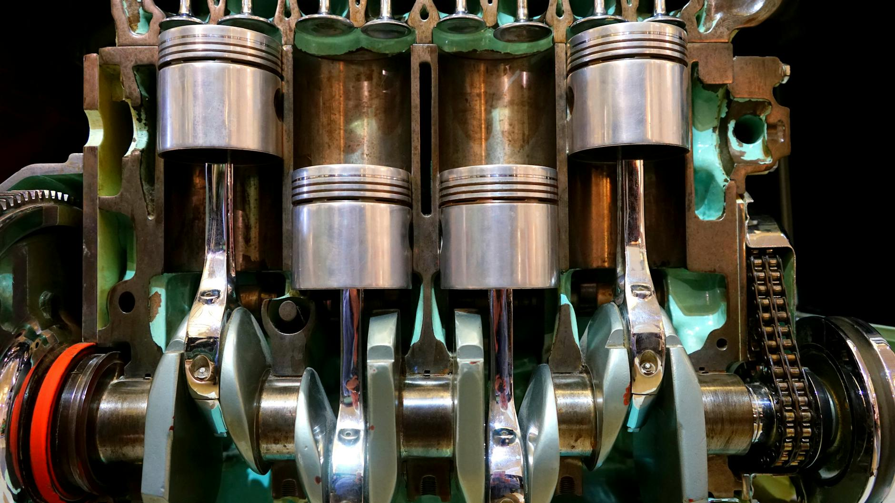

# UD3 Máquinas térmicas

!!! quote "Sadi Carnot (1796-1832)"
    "El calor es la fuerza motriz del universo. 
    Sin él, no habría movimiento ni vida posible."

Las máquinas térmicas transforman energía calorífica en trabajo mecánico. 
El estudio del ciclo de Carnot, los motores de combustión interna y las 
bombas de calor nos permite comprender cómo funcionan desde un motor 
de automóvil hasta una central eléctrica o un sistema de aire acondicionado.

---

[Descargar UD3 Máquinas térmicas](https://drive.google.com/file/d/1Jsz_gSAzifWj2xIpwlqc3xv4M2YnNCsw/view?usp=drive_link){ .md-button .md-button--primary }