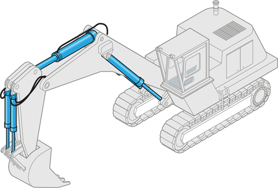

# UD4 Neumática e hidráulica

[Descargar UD4 Neumática e hidráulica](https://drive.google.com/file/d/1OfzZUMb1LbVdlm2ed2LK_QcGfyGw7mkp/view?usp=drive_link){ .md-button .md-button--primary }

---

!!! quote "Blaise Pascal (1623-1662)"
    "La presión ejercida en cualquier punto de un fluido 
    en reposo se transmite íntegramente en todas direcciones."

La neumática e hidráulica estudian el uso de fluidos a presión 
para transmitir fuerza y movimiento. Estos sistemas están presentes 
en multitud de aplicaciones industriales, desde brazos robóticos y 
prensas hidráulicas hasta frenos de vehículos y sistemas de control 
de aeronaves.

---

