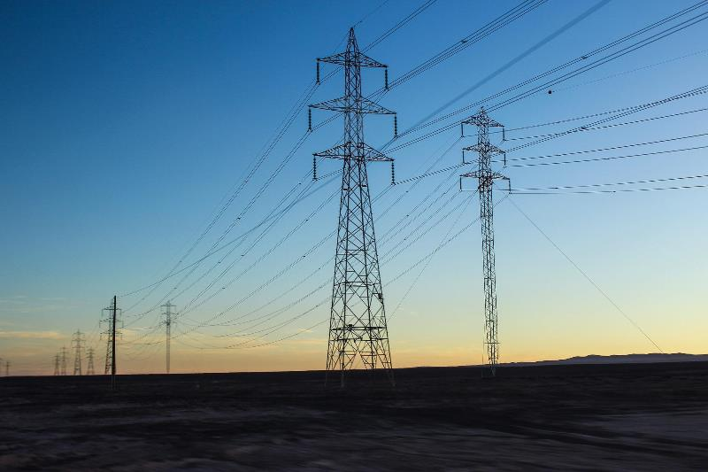

# UD5 Corriente alterna

[Descargar UD5 Corriente alterna](https://drive.google.com/file/d/1pmb1Car_pAEF1xZtjXQKPMKPoHssJ1B0/view?usp=sharing){ .md-button .md-button--primary }

[IES Enrique Díez Canedo](https://sites.google.com/educarex.es/conticdetecnologia/2%C2%BA-bach-tei?authuser=0)

---
!!! quote "Thomas Edison (1847-1931)"
    "La electricidad es la fuerza más poderosa que el hombre ha podido aprovechar."

La corriente alterna es la forma de energía eléctrica que llega a 
nuestros hogares e industrias. El estudio de los circuitos RLC, las 
potencias activa, reactiva y aparente, y el factor de potencia nos 
permite analizar y optimizar instalaciones eléctricas, desde motores 
industriales hasta sistemas de distribución eléctrica.

---