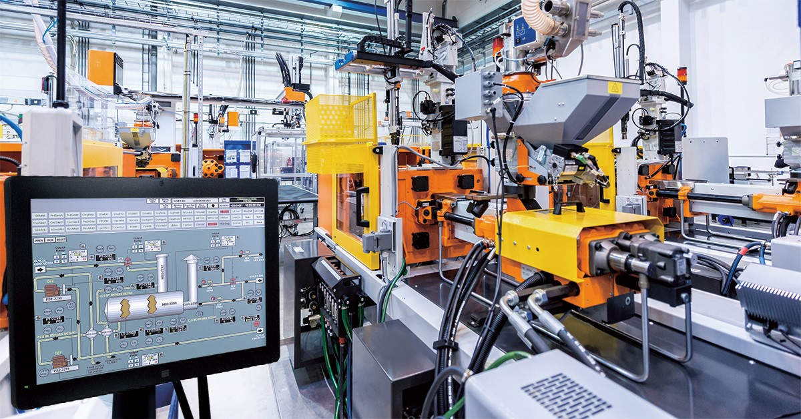

# UD7 Sistemas automáticos

!!! quote "Katsuhiko Ogata"
    "El control automático ha desempeñado una función vital en el avance de la ingeniería 
    y la ciencia. Ha pasado a ser una parte importante e integral de los procesos modernos 
    industriales y de manufactura."

{ .md-image-center }

El control automático estudia los sistemas capaces de regular su propio comportamiento 
sin intervención humana continua, desde simples termostatos hasta complejos sistemas 
aeroespaciales.

---

[Descargar UD7 Sistemas automáticos](https://drive.google.com/file/d/1RJUEZcGqEh1qOfxKMtTJGpuGJjyi72XL/view?usp=sharing){ .md-button .md-button--primary }

---

[Función de transferencia](https://drive.google.com/file/d/1olquOXEu2suujmKE8G74Ur7383shB4BH/view?usp=sharing){ .md-button .md-button--primary }

---

[Ejercicios resueltos FT](https://drive.google.com/drive/folders/10ry21rDaCgGwn3TzKcaeIyraOcwE-jKs?usp=drive_link){ .md-button .md-button--primary }
